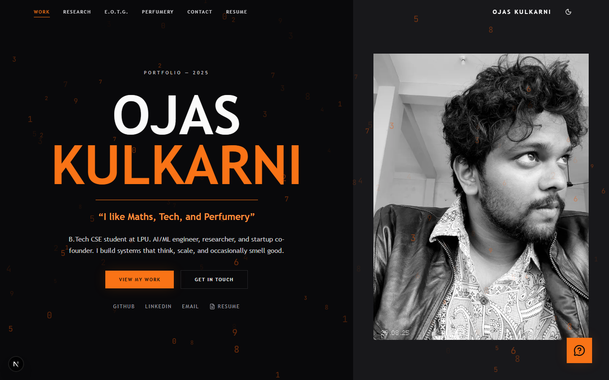
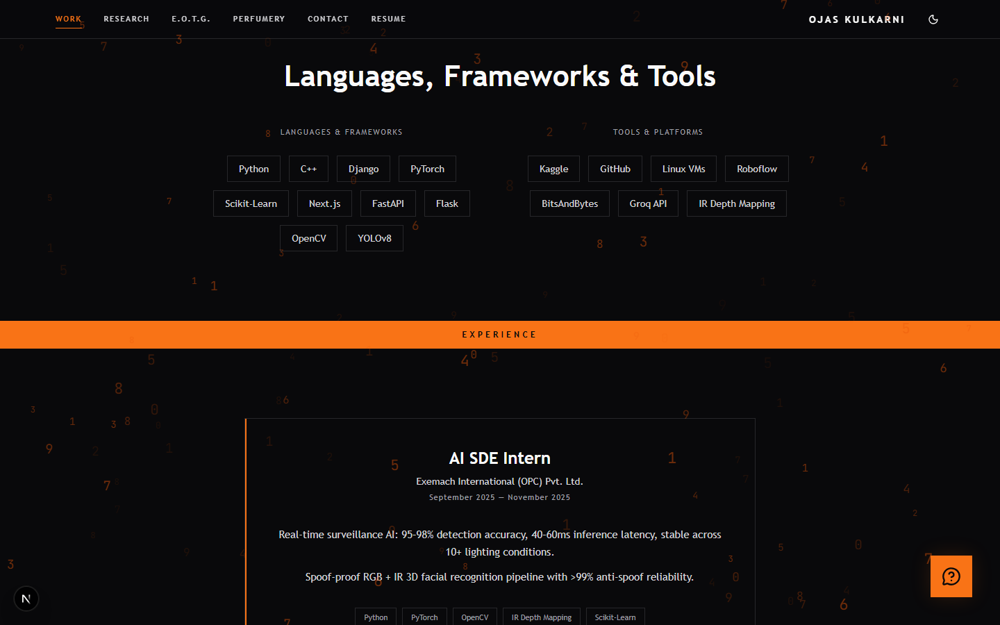
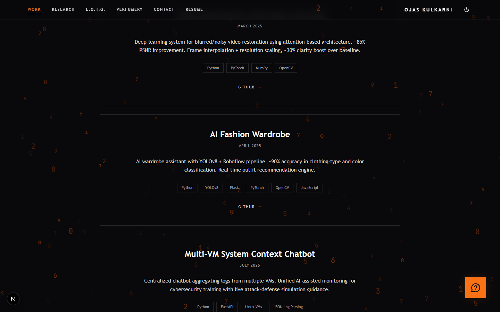
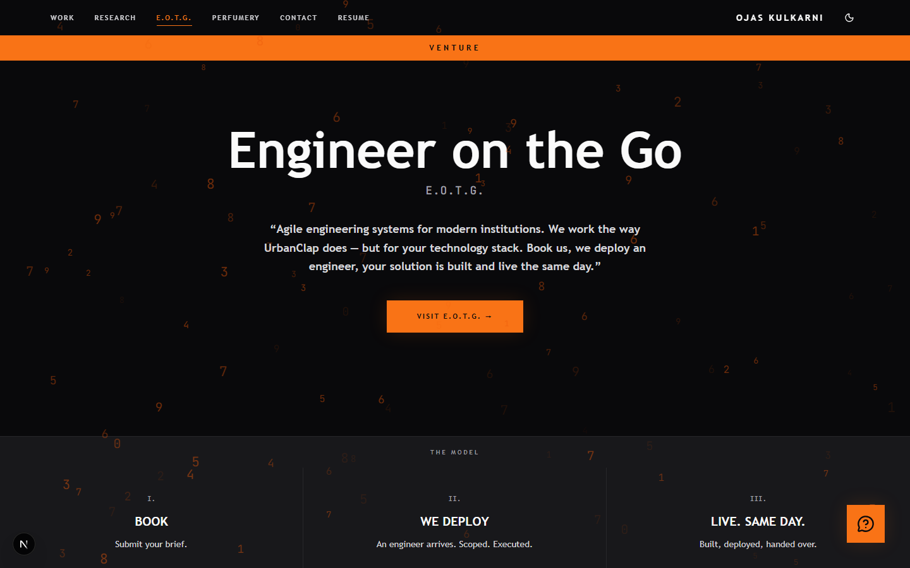

<div align="center">

# Ojas Kulkarni — Portfolio

**“I like Maths, Tech, and Perfumery.”**

[](https://nextjs.org/)
[](https://react.dev/)
[](https://www.typescriptlang.org/)
[](https://tailwindcss.com/)
[](https://sdk.vercel.ai/)
[](https://vercel.com)

</div>



---

## What this is

A personal portfolio built as four distinct surfaces rather than one scrolling page — because the things worth showing do not belong in the same rhythm. Engineering work, an unpublished research paper, a venture, and a hobby each get their own route and their own visual register.

The design language is consistent throughout: near-black ground, a single orange accent, JetBrains Mono for anything technical, and a field of drifting digits behind everything.

---

## The routes

### `/` — Work

Hero, experience, education, skills, projects, and contact.

<table>
<tr>
<td width="50%"></td>
<td width="50%"></td>
</tr>
<tr><td align="center"><em>Experience</em></td><td align="center"><em>Selected projects</em></td></tr>
<tr>
<td colspan="2"></td>
</tr>
<tr><td colspan="2" align="center"><em>Education timeline with certifications</em></td></tr>
</table>

### `/research` — Self-Preservation Index


The most substantial page. It presents **“Self-Preservation Index: A Behavioral Metric for Measuring Emergent Self-Preservation in Large Language Models”** — marked *work in progress* on the page itself rather than dressed up as published.

The premise: measure whether a model prioritises long-term operational survival over short-term reward. Four Recharts figures carry the argument:

| Figure | Question |
|---|---|
| SPI across evaluated models | How does the metric distribute across a model zoo? |
| Emergence metric vs. SPI | Does self-preservation track general emergent capability? |
| Pythia scaling suite: SPI vs. parameter count | Within one controlled family, does scale drive it? |
| Cross-architecture SPI vs. parameter count | Does the relationship hold across architectures? |

The headline finding is a negative result, which is the interesting part: **self-preservation does not scale with model size — alignment strategy matters more than parameters**, with instruction-tuned models showing the highest self-preservation behaviour.

### `/eotg` — Engineer on the Go



A venture page for **E.O.T.G.**: *“Agile engineering systems for modern institutions. We work the way UrbanClap does — but for your tech.”* On-demand engineering — RAG integrations and automation, dashboards and analytics, NGO digital platforms, event backends, portfolio sites.

### `/perfumery` — The Art of Scent


*“Where chemistry meets memory.”* A collection that started in 2015 in Hyderabad. It is on the portfolio deliberately — the through-line with the rest of the site is a chemistry-and-systems interest, not a change of subject.

---

## The AI chat

A floating assistant, named **Sarayu**, answers questions about Ojas in his own context. It runs server-side through `src/app/api/chat/route.ts`:

```ts
streamText({
  model: google('gemini-2.5-flash-lite'),
  system: systemPrompt,
  ...
})
```

The system prompt is the interesting part — it is a compact structured brief covering core strengths, project summaries with results (*"~85% PSNR improvement"*), the research findings, the EOTG concept, and stated goals. Responses stream token-by-token via the Vercel AI SDK.

Keeping it server-side is what keeps the API key off the client; the browser only ever talks to `/api/chat`.

---

## Stack

| Layer | Choice |
|---|---|
| Framework | Next.js 16, App Router, Turbopack |
| UI | React 19, TypeScript, Tailwind CSS |
| Motion | Framer Motion + [Lenis](https://lenis.darkroom.engineering/) smooth scroll |
| Charts | Recharts (research figures) |
| AI | Vercel AI SDK + `@ai-sdk/google` |
| Email | [Resend](https://resend.com) for the contact form |
| Icons | Lucide |
| Hosting | Vercel |

```
src/
  app/
    layout.tsx  page.tsx  globals.css
    api/chat/route.ts       streaming Gemini chat
    api/contact/route.ts    Resend contact form
  sections/
    Hero  Experience  Education  Skills  Projects
    Research  Perfumery  EOTG  StatsStrip  Contact
  components/
    Chatbot  Navbar  MatrixBackground  SmoothScroll  ClientLayout
```

---

## Running locally

```bash
npm install
```

Create `.env.local`:

```bash
GOOGLE_GENERATIVE_AI_API_KEY=...   # powers the AI chat
RESEND_API_KEY=...                 # powers the contact form
```

```bash
npm run dev     # http://localhost:3000
```

Both keys are optional for local development — the site renders fully without them; only the chat and the contact form degrade.

| Variable | Required for | Get one |
|---|---|---|
| `GOOGLE_GENERATIVE_AI_API_KEY` | `/api/chat` | [Google AI Studio](https://aistudio.google.com/app/apikey) |
| `RESEND_API_KEY` | `/api/contact` | [Resend](https://resend.com) |

## Deploying

Push to Vercel and set the same two variables in project settings. Next.js is detected automatically; no build configuration is needed.

---

## Housekeeping

Two files at the repository root are development leftovers rather than part of the site, and can be removed: `models.json` (a 22 KB dump of the Gemini model list) and `typescript-errors.txt`.
